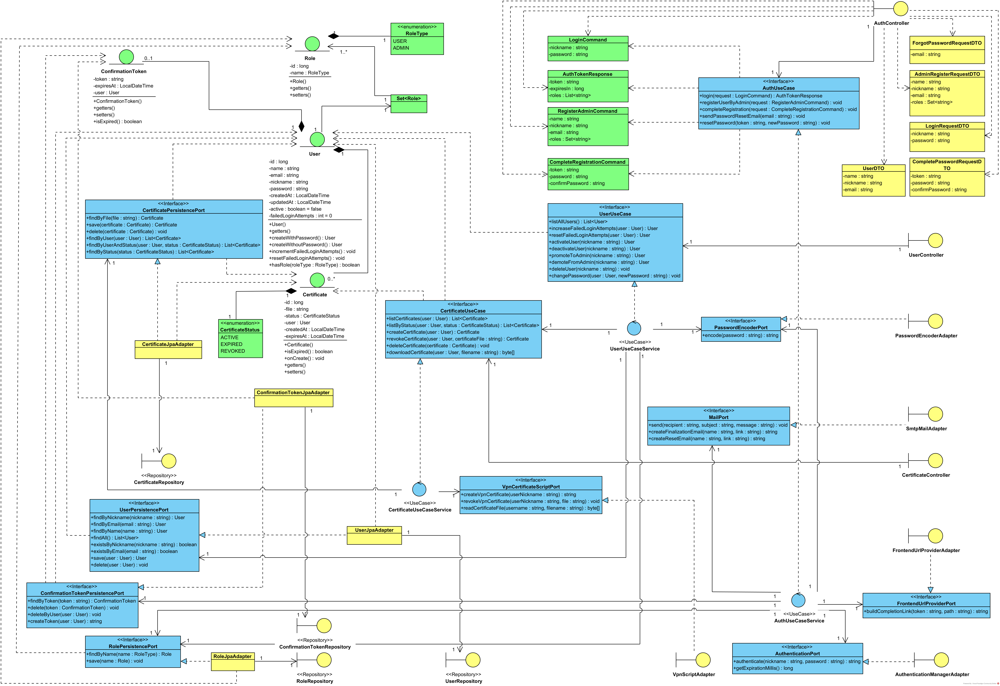

# VpnPanel

Painel de Gerenciamento de Certificados VPN com integração a Servidor OpenVPN 

## Visão Geral
VpnPanel é uma aplicação web desenvolvida em Java com Spring Boot, projetada para facilitar o gerenciamento de certificados VPN, usuários e permissões em ambientes corporativos. O projeto utiliza arquitetura hexagonal (Ports & Adapters), promovendo alta coesão, baixo acoplamento entre componentes, e facilitando a manutenção e a evolução do código.

---

## Tecnologias Utilizadas
- **Java 17**
- **Spring Boot 3.2.4**
- **Spring Data JPA**
- **Spring Security**
- **Spring Mail**
- **JWT (JSON Web Token)**
- **Hibernate Validator**
- **Lombok**
- **Swagger/OpenAPI (springdoc-openapi)**
- **MySQL 8+**
- **Maven**

---

## Principais Funcionalidades

- **Gerenciamento de Certificados VPN**: geração e revogação automatizada, listagem e download.
- **Administração de Usuários**: registro assistido (*administrador inicia o cadastro e o usuário finaliza*), autenticação via `JWT`, redefinição de senha e controle de acesso com base em papéis (roles).
- **Autenticação e Autorização**: proteção de rotas via `Spring Security` e tokens JWT.
- **Integração com Scripts**: execução de scripts Python para geração e revogação de certificados no servidor `OpenVPN`.
- **Envio de E-mails Automatizados**: mensagens com links de ativação e redefinição de senhavia `SMTP` (Simple Mail Transfer Protocol).
- **API RESTful Validada**: todas as requisições possuem validação com retorno padronizado de erros.

## Estrutura do Projeto
```
src/
  main/
    java/com/vpnpanel/VpnPanel/
      adapters/         # Adaptadores de portas do Core (JPA, REST, Scripts, Exceptions)
      application/      # Portas e casos de uso da aplicação
      config/           # Configurações globais e inicializadores de dados (ex: segurança)
      domain/           # Modelos de domínio, enums e commands
    resources/
      application.properties  # Configurações da aplicação
```

---

## Arquitetura
O projeto segue a **Arquitetura Hexagonal (Ports & Adapters)**:
- **Domain**: Regras de negócio e entidades centrais.
- **Application/Ports**: Interfaces de entrada e saída (casos de uso, gateways).
- **Adapters**: Implementações concretas (JPA, REST, integração com scripts Python, etc).
- **Config**: Configurações de segurança, beans, transações e inicializadores.

Essa abordagem facilita testes, manutenção e evolução do sistema.<br>
Para informações detalhadas sobre a arquitetura utilizada, acesse a [arquitetura do projeto][archi].

---

## Representação Diagramática
Abaixo está o diagrama de classes de projeto representando a lógica de negócio da aplicação com base no padrão BCE. O diagrama ilustra as principais classes parametrizadas, bem como as relações de associação, dependência e implementação entre os componentes da arquitetura.


---

## Pré-requisitos
- **Java 17** ou superior
- **Maven 3.6+**
- **MySQL 8+** ou outro SGBD

>**Para utilizar as funcionalidades de geração e revogação de certificados, é necessário que a aplicação esteja rodando em um servidor com OpenVPN configurado e que os scripts de geração e revogação estejam no caminho passado no arquivo `.env` na variável `VPN_CLIENTS_PATH`.<br>
Os scripts estão disponíveis no repositório [vpn-panel-redes][repo_scripts].**

---

## Variáveis de Ambiente
Configure o arquivo `.env` na raiz do projeto. Exemplo:
```env
FRONTEND_BASE_URL=...
JWT_SECRET_KEY=... # chave base64
EMAIL_SMTP_HOST=...
EMAIL_USERNAME=...
EMAIL_PASSWORD=...
EMAIL_SENDER=...
VPN_CLIENTS_PATH=...
DB_URL=jdbc:.../vpnpanel_db
DB_USER=vpnuser
DB_PASSWORD=...
ADMIN_DEFAULT_EMAIL=...
ADMIN_DEFAULT_NICKNAME=...
ADMIN_DEFAULT_PASSWORD=...
``` 
---

## Configuração do Banco de Dados
1. Edite o arquivo `.env` com as variáveis de ambiente necessárias (exemplo já incluso no projeto).

2. Execute o script `init-db.sql` para criar o banco e o usuário:
   ```sql
   -- Cria o banco de dados
   CREATE DATABASE IF NOT EXISTS vpnpanel_db CHARACTER SET utf8mb4 COLLATE utf8mb4_unicode_ci;
   -- Remove o usuário se já existir
   DROP USER IF EXISTS 'vpnuser'@'localhost';
   -- Cria o usuário
   CREATE USER 'vpnuser'@'localhost' IDENTIFIED BY 'SENHA-DO-USUARIO';
   -- Dá todas as permissões
   GRANT ALL PRIVILEGES ON vpnpanel_db.* TO 'vpnuser'@'localhost';
   FLUSH PRIVILEGES;
   ```
   Ou execute o comando via terminal MySQL (**Pode ser necessário adicionar o MySQL ao `PATH` do SO**):
   ```sh
   mysql -u root -p < init-db.sql
   ```

---

## Como Executar a Aplicação
### 1. Clonando o repositório
```sh
git clone <url-do-repositorio>
cd VpnPanel
```

### 2. Compilando e rodando (Linux/Mac)
```sh
./mvnw clean install
./mvnw spring-boot:run
```

### 3. Executando no Windows (usando script .bat)
O projeto inclui o script `start-app.bat` para facilitar a execução no Windows, evitando a configuração de variáveis de ambiente no sistema:

```bat
@echo off
:: habilita o acesso de variaveis dentro do loop
setlocal EnableDelayedExpansion

if not exist .env (
    echo ERRO: Arquivo .env não encontrado
    exit /b 1
)

echo Carregando variaveis de ambiente

:: le o arquivo linha por linha
for /f "usebackq tokens=* delims=" %%a in (.env) do (
    set "line=%%a"
    :: ignora linhas em branco e comentarios (# ou ;)
    if not "!line!"=="" if not "!line!"==" " if not "!line:~0,1!"=="#" if not "!line:~0,1!"==";" (
        set "!line!"
        echo "!line!"
    )
)

echo Inicializando banco de dados
:: com MySQL
mysql -u root -p -P 3306 < init-db.sql

echo Iniciando aplicacao
mvn spring-boot:run

endlocal
```

**Como usar:**
1. Certifique-se de que o MySQL está rodando.
2. Edite o `.env` conforme necessário.
3. Execute o script:
   ```sh
   start-app.bat
   ```

---

## Licença
Este projeto está sob a licença MIT.

---

## Contato
Dúvidas ou sugestões? Entre em contato pelo LinkedIn no meu GitHub ou abra uma issue no repositório.

<!--links-->
[archi]: ARCHITECTURE.md
[repo_scripts]: https://github.com/Yilumit/painel-vpn-redes
